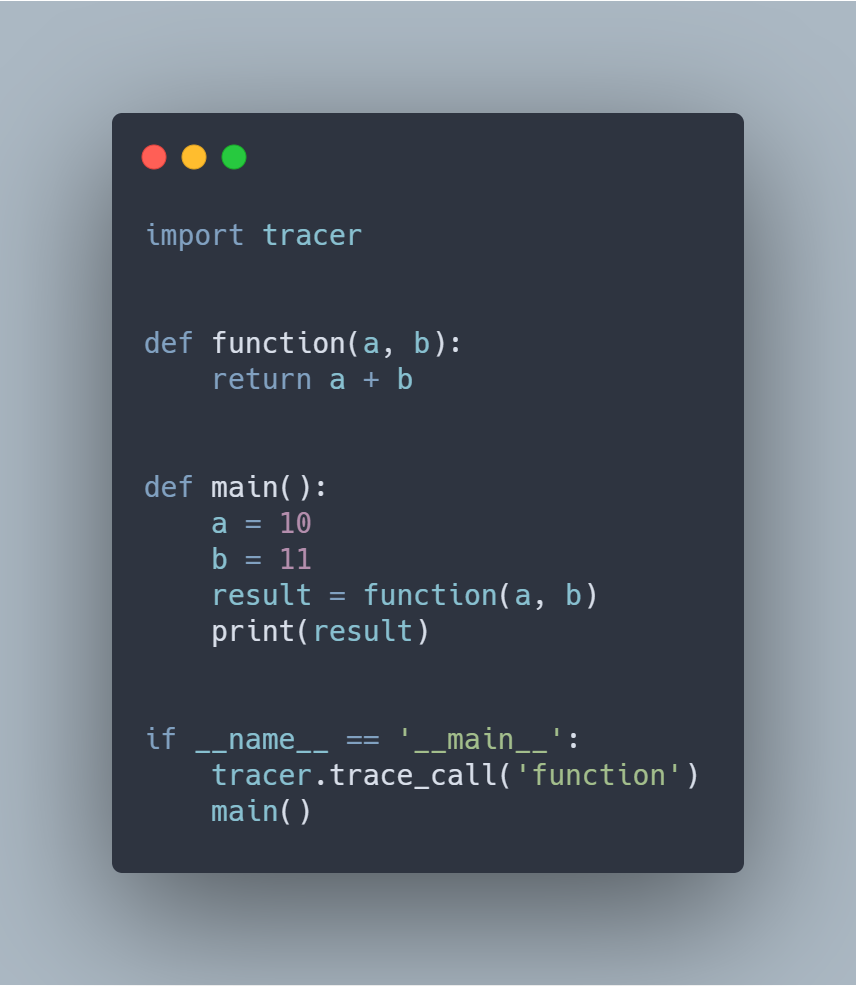
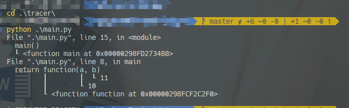

# tracer

simple tool for tracing call stack and debugging.

Inspire by [better_exceptions](https://github.com/Qix-/better-exceptions).

The `CallStackFormatter` was cut and customized from `better_exceptions.formatters`.

References

- [Python data model: frame object, code object and other relevant sections](https://docs.python.org/3.7/reference/datamodel.html#types)
- [sys.settrace](https://docs.python.org/3.7/library/sys.html#sys.settrace)

## example

